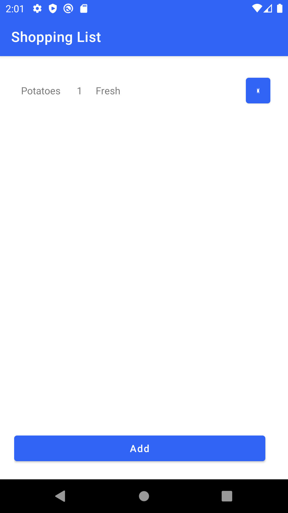

# This is University of Luxembourg project for the Mobile Development class

## High level requirements
Build a shopping list app, that allows adding new items, editing the existing ones, and deleting them. The main view should present the current state of the database and react to changes there.
The items have name, quantity and details.
The app should use a database for storing the data.

## Implementation
The app has 3 views:
- Main view: shows the list of items, allows adding new ones, and deleting them.
- Edit view: allows editing the item details.
- Add view: allows adding a new item.

Using Room for connecting to local SQLite database.

## Notes
- The add and edit activities are very similar, we have opportunity for some optimization, but decided to go with the simpler solution for now.
- For async operations, using naive solution of creating a new thread and running it there. For more production system we would use AsyncTasks or Executor Frameworks.
- The edit activity gets opened when the user clicks on an item in the main view. The item is passed as an extra to the activity.

## Screenshots

        

